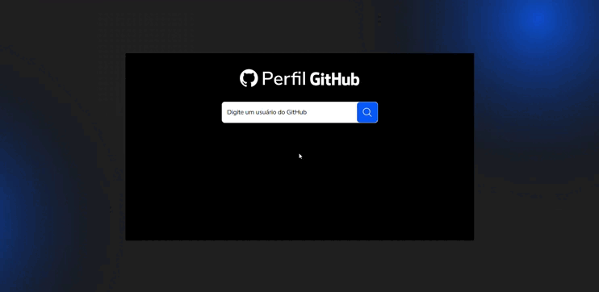

# 🚀 Projeto 02 - Busca de Perfil no GitHub (AVANTI)

Este projeto foi desenvolvido como parte de um desafio técnico com o objetivo de criar uma aplicação em **React** que busca e exibe informações de usuários do GitHub, seguindo o layout proposto no Figma.



## 📝 Objetivo

A aplicação permite pesquisar perfis do GitHub por nome de usuário e exibir dados como nome, bio e foto de perfil, com tratamento de erros e responsividade.

## 🔗 Layout no Figma

Acesse o layout clicando no link abaixo:

👉 [Visualizar no Figma](https://www.figma.com/proto/DqtFxC6312M32mLt8FpJjq/inovation-class?page-id=22%3A2864&node-id=22-4293&viewport=359%2C115%2C0.25&t=SHsEqEgaMrXGMKwv-1&scaling=scale-down-width&content-scaling=fixed&starting-point-node-id=22%3A4293&show-proto-sidebar=1)

## ✅ Requisitos Atendidos

✔️ Campo de busca para nome de usuário do GitHub.<br>
✔️ Consumo da **API pública do GitHub** para obter informações.<br>
✔️ Exibição das seguintes informações:

- Nome do usuário
- Foto de perfil
- Bio

✔️ Mensagens de erro caso o perfil não seja encontrado.<br>
✔️ Estilização seguindo o layout do Figma (utilizado Tailwind CSS).<br>
✔️ **(Opcional)** Melhoria da experiência com efeitos de loading durante a requisição.

## 🛠️ Tecnologias Utilizadas

- JavaScript
- React.js
- Tailwind CSS
- GitHub REST API

## 🚦 Como Executar o Projeto

1. Clone o repositório:

```bash
git clone https://github.com/seu-usuario/nome-do-repositorio.git
```

2. Acesse a pasta do projeto:

```bash
cd Avanti-GitHubProfileSearch
```

3. Instale as dependências:

```bash
npm install
```

4. Inicie o servidor local:

```bash
npm start
```

## 💡 Observações

- A aplicação trata perfis inexistentes com mensagens de erro amigáveis.

- Utiliza fetch para fazer a requisição à API do GitHub.

- Há um efeito de loading para melhor feedback visual ao usuário.

---

👩‍💻 Desenvolvido por Raissa Nazaré [@rajssq](https://github.com/rajssq)
